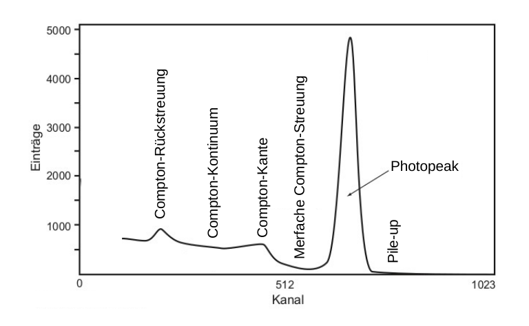

# Hinweise für den Versuch Gammaspektroskopie

## Gammaspektroskopie

### Spektrum, Histogramm und Dichte

Als Spektrum bezeichnet man die Untersuchung eines Objekts $\mathcal{O}$ nach einer Eigenschaft $X$.  Die Fragestellung lautet: "Wie häufig treffe ich $\mathcal{O}$ mit der Eigenschaft $X$ an?"

Diese Untersuchung erfolgt zunächst durch die Darstellung der [Häufigkeitsverteilung](https://de.wikipedia.org/wiki/H%C3%A4ufigkeitsverteilung) als [Histogramm](https://de.wikipedia.org/wiki/Histogramm), mit einer vorgegebenen Anzahl an Bins $i$. Auf der $x$-Achse des Histogramms werden die Werte (oder Ausprägungen) von $X$ aufgetragen, die bestimmen welchem Bin $i$ das Auftreten von $\mathcal{O}$ zuzuordnen ist; auf der $y$-Achse wird die Häufigkeit $\Delta N_{i}$ aufgetragen, mit der im Laufe einer Messreihe ein Objekt $\mathcal{O}$ dem Bin $i$ zugeordnet wurde. 

Die Werte von $\Delta N_{i}$ hängen sowohl von der Gesamtanzahl der Beobachtungen, als auch von der Breite der Bins $\Delta x_{i}$ ab. Teilt man $\Delta N_{i}$ durch jeweils beide Größen, bezeichnet man die entstehende Verteilung als [Dichtefunktion](https://de.wikipedia.org/wiki/Dichtefunktion). Sind alle $\Delta x_{i}$ gleich, ist die Form der Häufigkeitsverteilung zur Form der Dichtefunktion gleich, was nicht der Fall ist, wenn $\Delta x_{i}$ für unterschiedliche $i$ variiert.  Im Grenzübergang unendlich vieler Bins verschwindend kleiner Breiten $\Delta x_{i}$ geht der Differenzenquotient in die Ableitung über: 
$$
\begin{equation*}
\lim\limits_{i\to\infty} \frac{\Delta N_{i}}{\Delta x_{i}} = \frac{\mathrm{d}N}{\mathrm{d}x}; \quad \text{mit: }\Delta x_{i}\to 0.
\end{equation*}
$$
Man findet daher auch oft Bezeichnungen, wie $\mathrm{d}N/\mathrm{d}x$ an der $y$-Achse eines Histogramms, bei dem die Häufigkeiten durch $\Delta x_{i}$ geteilt wurde. 

### Photondetektor

In diesem Versuch bestimmen Sie, wie häufig ein einlaufendes Photon $\gamma$ mit der Energie $E_{\gamma}$ in einer vorgenommenen Messreihe auftritt. Die Bestimmung von $E_{\gamma}$ erfolgt über den Nachweis elektrischer Ladung in einem geeigneten Detektormaterial. Die Ladung wird durch Photoeffekt, Compton-Effekt und Paarbildung im Detektormaterial primär erzeugt. **Abbildung 5** zeigt, in welchen Bereichen von $E_{\gamma}$ welcher Prozess die Wechselwirkung von Photonen mit Materie dominiert. Dabei bezeichnet $Z$ die Kernladungszahl des Detektormaterials.

  

**Abbildung 5** (Dominante Bereiche für Photoeffekt, Compton-Effekt und Paarbildung, aus [H. Kolanoski, N. Wermes *Teilchendetektoren* (DOI 10.1007/978-3-45350-6)](file:///home/rwolf/Downloads/978-3-662-45350-6-1.pdf).)

---

#### Elektromagnetischer Schauer

Für $E_{\gamma}\gg 10\,\mathrm{MeV}$ erfolgt der Energieverlust in Materie durch ein Wechselspiel aus Paarbildung und Bremsstrahlung der entstehenden Elektronen-Positron-Paare. Dies ist der Fall, bis eine bestimmte Energieschwelle unterschritten wird. Für Elekronen (Positronen) bezeichnet man diese Schwelle als [kritische Energie](https://de.wikipedia.org/wiki/Strahlungsl%C3%A4nge) ($E_{\mathrm{krit.}}$). Für $E_{\mathrm{e}}\lesssim E_{\mathrm{krit.}}$ überwiegt bei Elektronen (Positronen) der Energieverlust durch Ionisation den Energieverlust durch Bremsstrahlung. Als Faustformel für die Berechnung gilt:
$$
\begin{equation*}
E_{\mathrm{krit.}} \approx \frac{610\,\mathrm{MeV}}{Z+1.24}.
\end{equation*}
$$
Tabellarische Werte können z.B. [hier](https://pdg.lbl.gov/2015/AtomicNuclearProperties/) nachgeschlagen werden. 

Für Photonen überwiegt im Bereich zwischen $E_{\gamma}=100\,\mathrm{keV}$ bis $10\,\mathrm{MeV}$ der Compton-Effekt, für $E_{\gamma}\lesssim100\,\mathrm{keV}$ dominiert schließlich der Photoeffekt. Das Produkt jeder Reaktion sind Elektronen, Positronen und sekundäre Photonen jeweils niedrigerer Energie, wobei mit sinkender Energie schließlich der Photoeffekt als Prozess für die Entstehung weiterer Photonen im Detektormaterial dominiert. 

Aus einem einlaufenden Photon mit $E_{\gamma}\gg 10\,\mathrm{MeV}$ entsteht im Detektormaterial auf diese Weise eine große Zahl an Ladungsträgern, proportional zu $E_{\gamma}$, mit Energien im Bereich weniger $\mathrm{eV}$. Man bezeichnet diesen Vorgang als [elektromagnetischen Schauer](https://de.wikipedia.org/wiki/Elektromagnetischer_Schauer). Einfache Modelle zur Beschreibung elektromagnetischer Schauer gehen ebenfalls auf Walter Heitler zurück. 

#### Detektormaterial

Detektoren zur Bestimmung von Teilchenenergien bezeichnet man allg. als [Kalorimeter](https://de.wikipedia.org/wiki/Kalorimeter_(Teilchenphysik)). Ein Kalorimeter sollte eine hohe Energieauflösung und kurze Nachweiszeiten aufweisen. Es sollte außerdem groß genug sein, so dass Sekundärteilchen, z.B. eines elektromagnetischen Schauers, das aktive Detektormaterial möglichst nicht verlassen können. 

Man unterscheidet zwei Nachweisprinzipien der im elektromagnetischen Schauer entstandenen Ladungsträger: 

- Sie werden durch äußere elektrische Felder getrennt und direkt als abfallende Spannung über einen Lastwiderstand ausgelesen (Ionisationkalorimeter).
- Sie regen das Detektormaterial selbst wiederum zum Leuchten, d.h. zur Emission von Photonen, an. Diese Methode nutzt das Phänomen der [Szintillation](https://de.wikipedia.org/wiki/Szintillator), das einige Materialien aufweisen, die sich daher als Detektormaterial besonders eignen. Das entstehende Licht wird gesammelt, durch Photoeffekt wieder in ein elektrisches Signal umgewandelt und daraufhin als abfallende Spannung über einen Lastwiderstand ausgelesen (Szintillationskalorimeter).

Um $E_{\gamma}$ in diesem Versuch zu bestimmen verwenden wir einen anorganischen [Szintillationszähler](https://de.wikipedia.org/wiki/Szintillationsz%C3%A4hler), bestehend aus mit Tallium dotiertem $\mathrm{NaJ}$ ($\mathrm{NaJ(Tl)}$). Dieser Nachweis hat den Vorteil, dass man i.a. keine äußere Spannung an das u.U. großflächig verbaute aktive Detektormaterial anlegen muss. Ein Nachteil besteht darin, dass nicht jedes Elektron (Positron) aus dem elektromagnetischen Schauer zur Emission eines Szintillations-Photons führt. Wichtige Eigenschaften nach denen Szintillationsmaterialien ausgewählt werden sind: 

- Es sollten möglichst viele Szintillationsniveaus im Material angeregt werden, um eine möglichst hohe Ausbeute an Szintillationslicht pro Ladungsträger zu erreichen.
- Die Lebensdauer dieser Niveaus ([Relaxationszeit](https://de.wikipedia.org/wiki/Relaxation_(Naturwissenschaft))) sollte nicht zu hoch sein, damit der Detektor zeitlich dicht aufeinander folgende Signale auflösen kann. 
-  Der Detektor sollte für das erzeugte Szintillationslicht möglichst transparent sein.
- Es sollte eine zur Wellenlänge des Szintillationslichts passende Photokathode mit hoher [Quantenausbeute](https://de.wikipedia.org/wiki/Quantenausbeute) existieren (siehe nächster Abschnitt). 

Als Szintillator hat $\mathrm{NaJ(Tl)}$ die folgenden konkreten Eigenschaften:

- Maximale Wellenlänge des emittierten Lichts: $423\,\mathrm{nm}$ (d.h. ${\approx}3\,\mathrm{eV}$);
- Anzahl emittierter Photonen pro $\mathrm{MeV}$: 43000;
- Relaxationszeit der Anregung: $245\,\mathrm{ns}$.

Damit hat dieser Szintillator, im Vergleich zu anderen Materialien eine hohe Ausbeute an Szintillationsphotonen; im Gegenzug weist er eine vergleichsweise hohe Relaxationszeit auf. Die Prozesse des oben beschriebenen elektromagnetischen Schauers laufen deutlich schneller ab, so dass die individuellen Prozesse zur Deposition von $E_{\gamma}$ zeitlich nicht aufgelöst sondern als ein Prozess ausgelesen werden. 

#### Auslesekette

Nach Erzeugung des Szintillationslichts besteht die primäre Aufgabe darin, dieses  Licht möglichst verlustfrei aus dem aktiven Detektormaterial heraus zur weiteren Auslese zu leiten. Um zu vermeiden, dass es den Szintillator ohne Nachweis verlässt ist dieser i.a. von einem diffus reflektierenden Material umgeben. Zusätzlich kann sich an das (beliebig geformte) aktive Detektormaterial ein sog. [Lichtleiter](https://de.wikipedia.org/wiki/Lichtleiter) anschließen, um den Weg des Szintillationslichts durch den Detektor an die geometrischen Vorgaben der weiteren Auslesekette anzupassen. Grenzflächen müssen möglichst dicht anschließen, um Verluste durch Rückstreuung beim Übergang von einem ins andere Material zu vermeiden.

Die weitere Auslese erfolgt erneut durch die Rückübersetzung der einzelnen Szintillationsphotonen in Ladungsträger (d.h. Elektronen), in unserem Fall an der Photokathode (PK) eines [Photomultipliers](https://de.wikipedia.org/wiki/Photomultiplier) (PM). Diese Rückübersetzung erfolgt, bei den nun sehr viel geringeren Energien des Szintillationslichts von wenigen $\mathrm{eV}$, wiederum durch den Photoeffekt. Das Verhältnis der Anzahl ausgeschlagener Elektronen über der Anzahl auftreffender Photonen bezeichnet man als [Quantenausbeute](https://de.wikipedia.org/wiki/Quantenausbeute) $q$. Sie ist eine wichtiges Qualitätmerkmal eines PM. Typische Werte für $q$ liegen bei 25–50%.   

Die effektive Anzahl resultierender Elektronen an der Photokathode $N_{\mathrm{e}}$ einer solchen Anordnung, für ein einlaufendes Photon $\gamma$ mit $E_{\gamma}$, ist von der Größenordnung 100, was einer Ladung von $10^{-17}\,\mathrm{C}$ entspricht. U.a. werden Sie diese Zahl für die Messanordnung dieses Versuchs selbst abschätzen. An der kleinsten plausiblen Kapazität von ${\approx}10\,\mathrm{pF}$, führt eine Ladung von $10^{-17}\,\mathrm{C}$ zu einer praktisch nicht messbaren Spannungsänderung von ${\approx}1\,\mathrm{\mu V}$. Um ein messbares elektrisches Signal zu erhalten ist es daher notwendig $N_{\mathrm{e}}$ zu vervielfachen. Dies erfolgt in einem PM über eine Folge von 10–14 Prallelektroden (Dynoden) im sogenannten Sekundärelektronenvervielfacher-Abschnitt (SEV). Jede Dynode liegt dabei gegenüber der vorangehenden Dynode auf einem typischerweise $100\,\mathrm{V}$ höheren Potential. Die Dynoden weisen eine spezielle Beschichtung auf, um ein möglichst hohes Verhältnis von ausgeschlagenen Sekundärelektronen pro einfallendem Elektron (Sekundäremissionsverhältnis, $\delta$) zu erreichen. Typische Werte von $\delta$ liegen zwischen 3 und 10. Die Anzahl ausgeschlagener Elektronen, wächst dadurch exponentiell an. Für eine mittlere Anzahl von $\overline{\delta}=4$ und 10 Dynoden ergibt sich eine erwartete Verstärkung des Signals von $\mu_{V}\approx10^{6}$, was zu einem leicht messbaren Signal führt.

Der SEV wird mit einer regelbaren, stabilisierten Hochspannung betrieben. Die Notwendigkeit der Stabilisierung ergibt sich aus der starken Abhängigkeit von $\mu_{V}$ von der Beschleunigungsspannung. Das Spannungssignal wird an einem Ausgangswiderstand $R_{a}$ in der Leitung zur letzten Elektrode (d.h. der Anode) des SEV abgegriffen. Dabei ist $R_{a}$ so bemessen, dass zusammen mit einer immer vorhandenen Streukapazität $C$ eine Integrations-Zeitkonstante 
$$
\begin{equation*}
\tau=R_{a}\,C
\end{equation*}
$$
resultiert, die groß gegen die Relaxationszeit des Szintillators (siehe oben), aber klein gegen den zu erwartenden mittleren zeitlichen Abstand zweier einlaufender Photonen $\gamma$ ist. 

Die erste Forderung stellt sicher, dass ein Spannungssignal erzeugt wird, das proportional zur $E_{\gamma}$ ist. Die letzte Forderung berücksichtigt, dass sich aus zwei dicht aufeinander folgenden einlaufenden Photonen $\gamma$ und $\gamma'$ nicht ein gemeinsamer Spannungsimpuls aufbauen sollte, eine Situation, die man auch als [pile-up](https://de.wikipedia.org/wiki/Pile-up) bezeichnet. Dass sich dies, je nach Messanordnung jedoch nicht immer vermeiden lässt werden Sie im Verlauf des Experiments beobachten können. 

Die Skizze eines typischen Photondetektors einschließlich Auslesekette und PM ist in **Abbildung 6** gezeigt: 

**Abbildung 6:** (Skizze eine Photodetektors, wie er für diesen Versuch verwendet wird)

---

Das analoge Spannungssignal des PM wird mit Hilfe eines 12-Bit [Vielkanalanalysators](https://de.wikipedia.org/wiki/Vielkanalanalysator) ([*Multichannel analyzer*](https://en.wikipedia.org/wiki/Multichannel_analyzer) MCA) vom Typ [Rep Pitaya](https://de.wikipedia.org/wiki/Red_Pitaya) in bis zu 4096 Kanälen ausgelesen. Die Auslesekanäle des MCA entsprechen den Histogramm-Bins auf der $x$-Achse. Eine einfache graphische Benutzeroberfläche erlaubt die Beobachtung der aufgezeichneten Signale, während der Datennahme, unter Verwendung des MCPHA als [Oszilloskop](https://de.wikipedia.org/wiki/Oszilloskop) oder [Spektrumanalysator](https://de.wikipedia.org/wiki/Spektrumanalysator). Die Datennahme erfolgt in zuvor festgelegten Zeitabschnitten. Zur abschließenden Auswertung können Sie das aufgezeichnete Spektrum z.B. in [csv-Format](https://de.wikipedia.org/wiki/CSV_(Dateiformat)) ausgeben lassen und auf dem Jupyter-server weiter verarbeiten. 

### Zufall und Statistik

Bei den Wechselwirkungen einzelner Teilchen mit Materie handelt es sich um probabilistische Vorgänge. Ob ein auf den Detektor auftreffendes Photon $\gamma$ seine gesamte Energie $E_{\gamma}$ im Detektor deponieren, oder ein gestreutes Photon $\gamma'$ den Detektor nach Compton-Streuung wieder verlassen wird ist nicht deterministisch vorhersagbar. All diesen Ereignissen lassen sich jedoch feste und immer gleiche Wahrscheinlichkeiten zuordnen.

Ebenso ist die Entstehung des zu $\gamma$ gehörigen Signals $Q(E_{\gamma})$ mit dem Produkt einer schier unüberschaubar großen Anzahl an Einzelwahrscheinlichkeiten $p_{k}$ verbunden. Diese quantifizieren z.B.

- das Auftreten einzelner Wechselwirkungen hoch-energetischer Photonen mit dem Detektormaterial; 
- die Erzeugung von Ladungsträgern und Szintillationsphotonen im Detektormaterial; 
- das Auftreten von Primärelektronen $e_{i}$ an der PK; 
- die Vervielfachung der $e_{i}$ im SEV, sowie die sich anschließende, weitere, elektronische Signalverstärkung und Übersetzung in Kanäle des MCPHA. 

Für die folgenden Betrachtungen lassen wir die Vervielfachung der $e_{i}$ im SEV, sowie die sich daran anschließende weitere Signalverarbeitung zunächst außer Acht. Wir werden später darauf zurückkommen.

Die Wahrscheinlichkeit für das Auftreten eines Primärelektrons an der PK folgt, den obigen Überlegungen zufolge, einer uns unbekannten Wahrscheinlichkeitsverteilung 
$$
\begin{equation*}
P_{\omega\in\Omega} = \sum\limits_{\omega\in\Omega}\,\prod\limits_{k\in\omega}p_{k},
\end{equation*}
$$
die wir theoretisch ermitteln könnten, wenn wir allen möglichen Prozessketten $\omega\in\Omega$ folgen würden, die zur Erzeugung eines Primärelektrons an der PK führen können. Diese Annahme ist allerdings wirklich nur theoretischer Natur, da die Anzahl an $\omega$ sehr, wenn nicht gar unendlich groß ist. Wir müssen uns also damit abfinden, dass die Kenntnis von $P_{\omega\in\Omega}$ für uns unerreichbar ist. Wir stellen jedoch fest, dass $P_{\omega\in\Omega}$ für alle $e_{i}$ gleich ist. Weiterhin ordnen wir $P_{\omega\in\Omega}$, zur weiteren Charakterisierung, den Erwartungswert $\mu_{P}$ und die Standardabweichung $\sigma_{P}$ zu. 

Ein wichtiger Schritt in den weiteren Überlegungen ist, dass wir im folgenden nicht die Wahrscheinlichkeit für das konkrete Auftreten $P_{\omega\in\Omega}(e_{i})$ eines bestimmten Primärelektrons $e_{i}$, sondern den Erwartungswert $\mu_{P}$ für das Auftreten eines Primärelektrons im Allgemeinen betrachten. In den folgenden Gleichungen taucht daher zwar der Erwartungswert $\mu_{P}$ auf, es handelt sich dabei aber um den Erwartungswert einer Wahrscheinlichkeit, die selbst ohne weiteres eine Zufallsvariable sein kann.

Das Signal an der PK setzt sich aus $N_{\mathrm{e}}$ Primärelektronen zusammen. Nach dem [Zentralen Grenzwertsatz](https://de.wikipedia.org/wiki/Zentraler_Grenzwertsatz) von Lindeberg-Lévy können wir davon ausgehen, dass die Summe aus $N_{\mathrm{e}}$ Einzelbeiträgen für $N_{\mathrm{e}}\gg0$ einer [Normalverteilung](https://de.wikipedia.org/wiki/Normalverteilung) mit
$$
\begin{equation}
\begin{split}
\mu_{N_{\mathrm{e}}}&=\sum\limits_{1}^{N_{\mathrm{e}}} \mu_{P} \\
\sigma_{N_{\mathrm{e}}} &= \sigma_{P}\,\sqrt{N_{\mathrm{e}}}
\end{split}
\end{equation}
$$
zustrebt. 

Beschränken wir uns auf die vollständige Absorption eines Strahls mono-energetischer Photonen $\gamma$ mit der Energie $E_{\gamma}$ ist aufgrund der statistischen Natur der Prozesse, die der Messung zugrunde liegen klar, dass wir für $Q(E_{\gamma})$ keine $\delta$-Distribution erwarten können. Stattdessen erwarten wir eine Normalverteilung deren Erwartungswert wir mit $\mu_{Q}$ und deren Standardabweichung wir mit $\sigma_{Q}$ bezeichnen werden, und die wir beide aus der aufgenommenen Messreihe bestimmen können. 

Für den Zusammenhang mit $\mu_{N_{\mathrm{e}}}$ und $\sigma_{N_{\mathrm{e}}}$ gilt
$$
\begin{equation}
\mu_{Q}=C\,\mu_{N_{\mathrm{e}}}; \qquad \sigma_{Q} = C\,\sigma_{N_{\mathrm{e}}},
\end{equation}
$$
wobei mit $C$ allerdings noch ein weiterer uns unbekannter Kalibrationsfaktor auftaucht, mit dessen Hilfe wir z.B. $\mu_{N_{\mathrm{e}}}$ aus $\mu_{Q}$ bestimmen würden. Beachten Sie, dass $Q(E_{\gamma})$ primär aus den Kanälen des MCPHA bestimmt wird. In **(2)** sind also zwei Gleichungen für die Bestimmung von $\mu_{N_{\mathrm{e}}}$ mit drei Unbekannten zusammengefasst. Können wir trotzdem etwas über $\mu_{N_{\mathrm{e}}}$ erfahren? Die Antwort lautet – ja, denn für den Grenzübergang $N_{\mathrm{e}}\gg0$ und $\mu_{P}\to0$ geht die Normalverteilung, die den Gleichungen **(1)** zugrunde liegt in die [Poisson-Verteilung](https://de.wikipedia.org/wiki/Poisson-Verteilung) über, für deren Standardabweichung bei vorgegebenem Erwartungswert $\mu_{N_{\mathrm{e}}}$ der Zusammenhang 
$$
\begin{equation}
\sigma_{N_{\mathrm{e}}}=\sqrt{\mu_{N_{\mathrm{e}}}}
\end{equation}
$$
gilt. Damit können wir $\sigma_{N_{\mathrm{e}}}$ als eine Unbekannte in den Gleichung **(2)** eliminieren und $\mu_{N_{\mathrm{e}}}$ wie folgt abschätzen:
$$
\begin{equation*}
\begin{split}
&\frac{\mu_{Q}}{\sigma_{Q}} = \frac{C\,\mu_{N_{\mathrm{e}}}}{C\,\sigma_{N_{\mathrm{e}}}} = \frac{C\,\mu_{N_{\mathrm{e}}}}{C\,\sqrt{\mu_{N_{\mathrm{e}}}}} = \sqrt{\mu_{N_{\mathrm{e}}}};\\
&\\
&\mu_{N_{\mathrm{e}}} = \left(\frac{\mu_{Q}}{\sigma_{Q}}\right)^{2}.
\end{split}
\end{equation*}
$$
Wir klären abschließend noch, warum $\sigma_{Q}$ durch $\mu_{N_{\mathrm{e}}}$ besimmt wird, während z.B. die Vervielfachung im SEV, trotz ihrer statistischen Natur, keine Rolle zu spielen scheint: 

Wir haben weiter oben in dieser Anleitung diskutiert, dass im SEV eine Verstärkung des Signals an der PK von $\mu_{V}\approx10^{6}$ leicht erreicht werden kann. Wir stellen uns vor, dass $\mu_{V}$ Bestandteil des Kalibrationsfaktors $C$ aus den Gleichungen **(2)** ist. Die Varianz von $\mu_{V}$ kann mit 
$$
\begin{equation*}
\mathrm{var}[\mu_{V}] = \frac{\sigma_{V}^{2}}{\mu_{V}}
\end{equation*}
$$
abgeschätzt werden, wobei $\sigma_{V}$ einen festen Wert hat, der aus der Varianz von $\delta$ (siehe oben) abgeleitet werden kann. Die Anzahl der Dynoden im SEV ist ohne Unsicherheit vorgegeben. Dadurch kann $\mathrm{var}[\mu_{V}]$ gerade bei großen Werten von $\mu_{V}$ von einigen Größenordnungen als sehr klein angenommen werden. Die Fluktuationen in der Bestimmung von $Q(E_{\gamma})$ werden also durch die Stelle in der Auslesekette dominiert, in der die kleinsten Zählraten auftreten. Diese werden durch den anschließenden Verstärkungsprozess dann nur noch skaliert. Diese Überlegungen motivieren, warum für einen Photodetektor, wie wir ihn für diesen Versuch verwenden Szintillatormaterialien mit hoher Szintillationslichtausbeute und PK mit hoher Quanteneffizienz von primärer Bedeutung sind. 

### Eigenschaften des Gammaspektrums

Die schematische Darstellung eines zu erwartenden mit einem Photondetektor aufgezeichneten Spektrums für einen Strahl mono-energetischer Photonen mit der Energie $E_{\gamma}$ ist in **Abbildung 7** gezeigt:

**Abbildung 7**: (Schematische Darstellung eines zu erwartenden mit einem Photondetektor aufgezeichneten Spektrums für einen Strahl mono-energetischer Photonen der Energie $E_{\gamma}$, nach [H. Kolanoski, N. Wermes *Teilchendetektoren* (DOI 10.1007/978-3-45350-6)](file:///home/rwolf/Downloads/978-3-662-45350-6-1.pdf).)

---

Es handelt sich dabei um ein Histogramm. Auf der $x$-Achse sind die Kanäle des MCPHA aufgetragen, auf der $y$-Achse die Häufigkeit, mit der ein Eintrag im entsprechenden Kanal aufgezeichnet wurde. Jeder Eintrag im Histogramm entspricht einer einzelnen Messung, ein Spektrum besteht also immer aus einer Vielzahl von Messungen. 

In der Abbildung sind die folgenden grundlegenden Eigenschaften eines Gammaspektrums klar zu erkennen:

- Der **Photopeak** bei $E_{\gamma}$ resultiert aus der vollständigen Absorption der nachgewiesenen Photonen. Wir erwarten eine Normalverteilung deren Erwartungswert mit $\mu_{Q}$ wir $E_{\gamma}$ zuordnen können.

- Einträge rechts des Photopeaks sind auf Energie-Depositionen mehrerer zeitgleich nachgewiesener Photonen (**pile-up**) zurückzuführen. 

- Das **Compton-Kontinuum** resultiert aus Ereignissen bei denen $\gamma$ ein Elektron aus dem Detektormaterial ausgelöst und dann den Detektor wieder verlassen hat. Die **Compton-Kante** entspricht dabei der Rückstreuung mit $\theta=180^{\circ}$. Die Compton-Kante ist für das Spektrum ebenso charakteristisch, wie der Photopeak. Sie befindet sich im Spektrum an der Position $Q(E^{\prime\,\mathrm{max}}_{\mathrm{e}})$, die nur von $E_{\gamma}$ und $m_{\mathrm{e}}$ abhängt.

- Einträge zwischen der Compton-Kante und dem Photopeak können durch **mehrfache Compton-Streuung** erklärt werden, nach der das gestreute Photon $\gamma'$ den Detektor schließlich verlässt. Würde $\gamma'$ den Detektor nicht verlassen würde die Messung zum Photopeak beitragen. 

- Ein weiteres charakteristisches Merkmal des gezeigten Spektrums ist ein Peak, der durch **Compton-Rückstreuung** entsteht. Dabei vollzieht $\gamma$ Compton-Streuung unter $180^{\circ}$, z.B. in einer den Detektor umgebenden Abschirmung. Das gestreute Photon $\gamma'$ wird daraufhin im Detektor aufgefangen und nachgewiesen, wo es die gesamte Energie $E'_{\gamma}(\theta=180^{\circ})$ in einem Photopeak deponiert.

In der Abbildung nicht gezeigt können für Photonen mit $E_{\gamma}\gtrsim10\,\mathrm{MeV}$, für die auch Paarbildung auftreten kann, noch zwei weitere charakteristische Peaks im Spektrum auftreten. Dabei wird das Positron aus der Paarbildung im Detektormaterial abgebremst und zerstahlt schließlich in zwei antiparallel auslaufende Photonen gleicher Energie $E'_{\gamma}=m_{\mathrm{e}}c^{2}$. Beim Auftreten des [**Single-Escape Peaks**](https://de.wikipedia.org/wiki/Escapelinie) entkommt eines dieser Photonen der Detektion; der Peak befindet sich an der Stelle
$$
\begin{equation*}
Q(E_{\mathrm{S.E.}}) = Q(E_{\gamma}-m_{\mathrm{e}}c^{2}),
\end{equation*}
$$
beim **Double-Escape Peak** entkommen beide Photonen der Detektion; der Peak befindet sich an der Stelle
$$
\begin{equation*}
Q(E_{\mathrm{S.E.}}) = Q(E_{\gamma}-2\,m_{\mathrm{e}}c^{2}).
\end{equation*}
$$

​    

 

Ihre erste Aufgabe bei diesem Versuch besteht darin, den Messaufbau mit $\gamma$-Stahlen bekannter Energie $E_{\gamma}$ zu kalibrieren, so dass Sie jedem Kanal eine entsprechende Energie zuordnen können.

# Navigation

[Main](https://gitlab.kit.edu/kit/etp-lehre/p1-praktikum/students/-/tree/main/Kreisel) | [Weiter](https://gitlab.kit.edu/kit/etp-lehre/p1-praktikum/students/-/tree/main/Kreisel/doc/Hinweise-Aufgabe-1-a.md)

